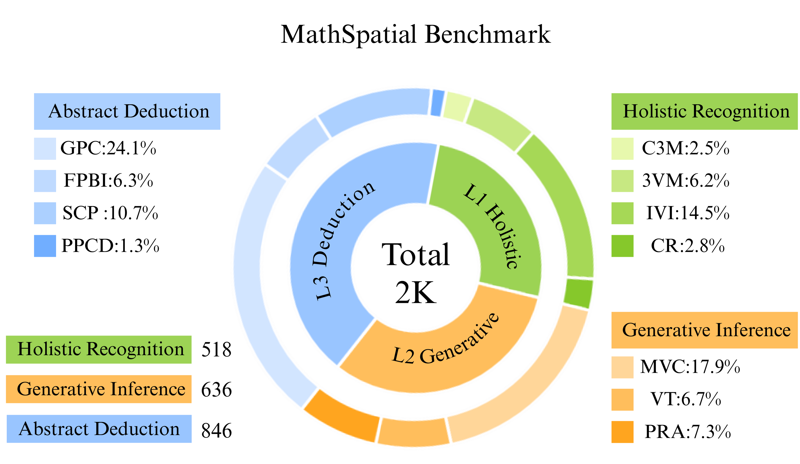
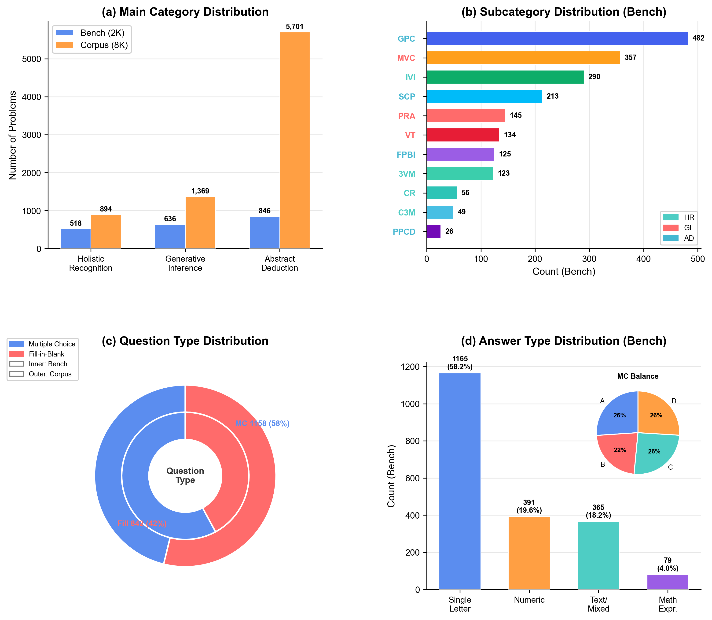
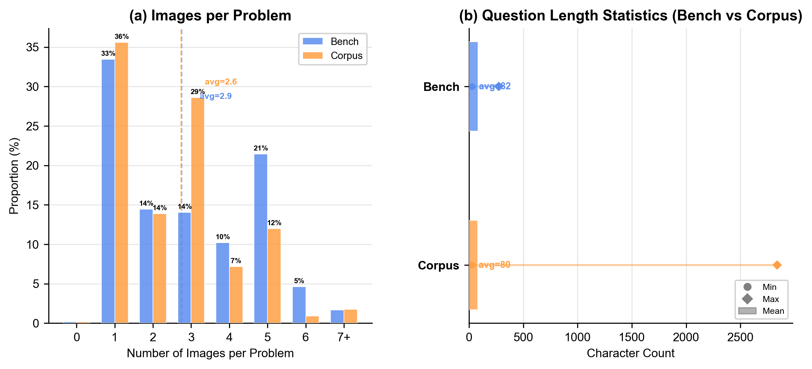
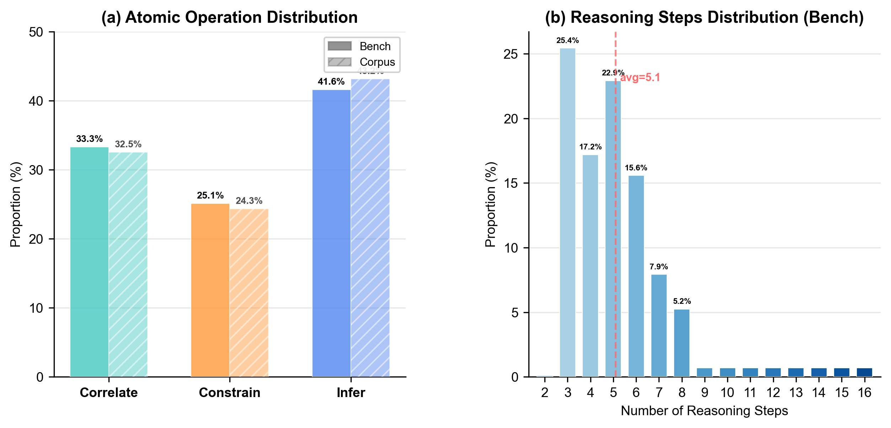
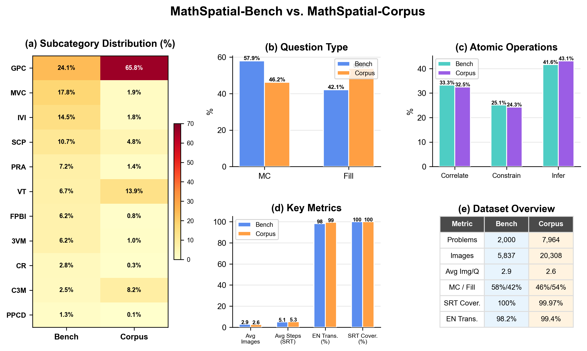

# MathSpatial Datasheet

Comprehensive statistics and documentation for MathSpatial-Bench and MathSpatial-Corpus, following the [Datasheets for Datasets](https://arxiv.org/abs/1803.09010) framework.

---

## 1. Overall Scale

| | MathSpatial-Bench | MathSpatial-Corpus | Total |
|:---|:---:|:---:|:---:|
| Problems | 2,000 | 8,000 | **10,000** |
| Images | 5,837 | 20,308+ | **26,145+** |
| Avg images/problem | 2.9 | 2.6 | 2.6 |
| With SRT annotation | 2,000 (100%) | 7,998 (99.97%) | 9,998 |
| With English translation | 1,963 (98.2%) | 7,951 (99.4%) | 9,914 |
| Image format | PNG | PNG | PNG |

---

## 2. Category Distribution

### 2.1 Main Categories

<p align="center">
  
</p>

**MathSpatial-Bench (2,000 problems):**

| Main Category | Count | Percentage |
|:---|:---:|:---:|
| Abstract Deduction | 846 | 42.3% |
| Generative Inference | 636 | 31.8% |
| Holistic Recognition | 518 | 25.9% |

**MathSpatial-Corpus (8,000 problems):**

| Main Category | Count | Percentage |
|:---|:---:|:---:|
| Abstract Deduction | 5,704 | 71.3% |
| Generative Inference | 1,386 | 17.3% |
| Holistic Recognition | 910 | 11.4% |

### 2.2 Subcategory Breakdown (11 subtypes)

**MathSpatial-Bench:**

| Category | Subtype | Full Name | Count | % |
|:---|:---:|:---|:---:|:---:|
| Holistic Recognition | CR | Cross-section Recognition | 56 | 2.8% |
| Holistic Recognition | 3VM | 3-View Matching | 123 | 6.2% |
| Holistic Recognition | IVI | Isometric View Identification | 290 | 14.5% |
| Holistic Recognition | C3M | Combine 3-View Matching | 49 | 2.5% |
| Generative Inference | PRA | Projection Reasoning & Analysis | 145 | 7.2% |
| Generative Inference | MVC | Multi-View Construction | 357 | 17.8% |
| Generative Inference | VT | View Transformation | 134 | 6.7% |
| Abstract Deduction | PPCD | Planar Path & Cutting Deduction | 26 | 1.3% |
| Abstract Deduction | FPBI | Folding Pattern & Box Inference | 125 | 6.2% |
| Abstract Deduction | SCP | Shadow & Cross-section Projection | 213 | 10.7% |
| Abstract Deduction | GPC | Geometric Property Calculation | 482 | 24.1% |

**MathSpatial-Corpus:**

| Category | Subtype | Count | % |
|:---|:---:|:---:|:---:|
| Holistic Recognition | CR | 20 | 0.3% |
| Holistic Recognition | 3VM | 77 | 1.0% |
| Holistic Recognition | IVI | 147 | 1.8% |
| Holistic Recognition | C3M | 650 | 8.2% |
| Generative Inference | PRA | 115 | 1.4% |
| Generative Inference | MVC | 150 | 1.9% |
| Generative Inference | VT | 1,104 | 13.9% |
| Abstract Deduction | PPCD | 11 | 0.1% |
| Abstract Deduction | FPBI | 66 | 0.8% |
| Abstract Deduction | SCP | 385 | 4.8% |
| Abstract Deduction | GPC | 5,239 | 65.8% |

> **Note:** The Corpus has a heavier distribution toward GPC (65.8%) reflecting the natural frequency in Chinese K-12 educational materials. The Bench is intentionally balanced across subtypes for fair evaluation.

---

## 3. Combined Statistics Overview

<p align="center">
  
</p>

### 3.1 Question Type Distribution

| | Multiple Choice | Fill-in-Blank |
|:---|:---:|:---:|
| **Bench** | 1,158 (57.9%) | 842 (42.1%) |
| **Corpus** | 3,676 (46.2%) | 4,285 (53.8%) |

### 3.2 Subtype × Question Type (Bench)

| Subtype | Multiple Choice | Fill-in-Blank | Total |
|:---|:---:|:---:|:---:|
| GPC | 172 | 310 | 482 |
| MVC | 190 | 167 | 357 |
| IVI | 242 | 48 | 290 |
| SCP | 91 | 122 | 213 |
| PRA | 130 | 15 | 145 |
| VT | 132 | 2 | 134 |
| FPBI | 54 | 71 | 125 |
| 3VM | 91 | 32 | 123 |
| CR | 31 | 25 | 56 |
| C3M | 14 | 35 | 49 |
| PPCD | 11 | 15 | 26 |

---

## 4. Answer Distribution

### 4.1 Answer Types (Bench)

| Type | Count | % |
|:---|:---:|:---:|
| Single letter (A/B/C/D) | 1,165 | 58.2% |
| Numeric | 391 | 19.6% |
| Other (text/mixed) | 365 | 18.2% |
| Math expression (√, π, etc.) | 79 | 4.0% |

### 4.2 Multiple-Choice Answer Balance

**Bench** — Near-uniform, indicating no answer-position bias:

| Answer | A | B | C | D |
|:---|:---:|:---:|:---:|:---:|
| Count | 301 | 259 | 295 | 300 |
| % | 26.1% | 22.4% | 25.5% | 26.0% |

**Corpus** — Slight skew toward B/C (raw educational data):

| Answer | A | B | C | D |
|:---|:---:|:---:|:---:|:---:|
| Count | 806 | 1,122 | 1,039 | 702 |
| % | 22.0% | 30.6% | 28.3% | 19.1% |

---

## 5. Image & Text Statistics

<p align="center">
  
</p>

### 5.1 Images per Problem

| # Images | Bench (count) | Bench (%) | Corpus (count) | Corpus (%) |
|:---:|:---:|:---:|:---:|:---:|
| 0 | 3 | 0.1% | 14 | 0.2% |
| 1 | 669 | 33.5% | 2,834 | 35.6% |
| 2 | 289 | 14.4% | 1,106 | 13.9% |
| 3 | 281 | 14.1% | 2,276 | 28.6% |
| 4 | 204 | 10.2% | 571 | 7.2% |
| 5 | 429 | 21.4% | 953 | 12.0% |
| 6+ | 125 | 6.3% | 210 | 2.6% |

### 5.2 Image Properties

- **Format:** PNG (100%)
- **Size range:** 0.5 KB – 71.1 KB
- **Average size:** 4.8 KB per image
- **Content:** Clean geometric diagrams, orthographic projections, 3D figure illustrations

### 5.3 Question Length

| | Bench (zh) | Bench (en) | Corpus (zh) | Corpus (en) |
|:---|:---:|:---:|:---:|:---:|
| Min chars | 27 | 6 | 27 | 21 |
| Max chars | 276 | 843 | 2,837 | 947 |
| Avg chars | 82 | 194 | 80 | 183 |

### 5.4 Choice Format

| | Image-based (placeholder text) | Real text choices | Contains Chinese text |
|:---|:---:|:---:|:---:|
| **Bench** | 1,457 (72.9%) | 543 (27.2%) | 377 (18.9%) |
| **Corpus** | 5,635 (70.8%) | 2,329 (29.2%) | 1,397 (17.5%) |

> ~70% of problems have image-based answer choices (depicted in the figure rather than as text).

---

## 6. Structured Reasoning Traces (SRT)

<p align="center">
  
</p>

### 6.1 Coverage

| | Bench | Corpus |
|:---|:---:|:---:|
| Has SRT (GPT-4o) | 2,000 (100%) | 7,962 (99.97%) |
| Successfully parsed | 1,868 (93.4%) | 7,317 (91.9%) |
| Has SRT (GPT-4.1) | 196 (9.8%) | 602 (7.6%) |

### 6.2 Atomic Operation Distribution

| Operation | Bench Count | Bench % | Corpus Count | Corpus % |
|:---|:---:|:---:|:---:|:---:|
| **Infer** | 3,929 | 41.6% | 16,663 | 43.1% |
| **Correlate** | 3,148 | 33.3% | 12,557 | 32.5% |
| **Constrain** | 2,374 | 25.1% | 9,395 | 24.3% |

Consistent ratio: **Infer > Correlate > Constrain** across both subsets.

### 6.3 Reasoning Steps per Trace (Bench)

| Metric | Value |
|:---|:---:|
| Min steps | 2 |
| Max steps | 16 |
| Average steps | 5.1 |
| Median | ~5 |

| # Steps | 3 | 4 | 5 | 6 | 7 | 8 | 9+ |
|:---|:---:|:---:|:---:|:---:|:---:|:---:|:---:|
| Count | 475 | 321 | 428 | 291 | 148 | 98 | 105 |
| % | 25.4% | 17.2% | 22.9% | 15.6% | 7.9% | 5.2% | 5.6% |

**Corpus:** Min 1, Max 18, Average 5.3 steps.

---

## 7. Data Quality Summary

| Quality Metric | Bench | Corpus |
|:---|:---:|:---:|
| English translation coverage | 98.2% | 99.4% |
| SRT annotation coverage | 100% | 99.97% |
| All 4 choices present | 99.95% | 100% |
| Has at least 1 image | 99.9% | 99.8% |
| Answer provided | 100% | 100% |
| MC answer balance (max deviation from 25%) | 3.6% | 5.6% |

---

## 8. Bench vs. Corpus Comparison

<p align="center">
  
</p>

Key differences between the two splits:

| Aspect | Bench | Corpus |
|:---|:---|:---|
| **Purpose** | Diagnostic evaluation | Training supervision |
| **Size** | 2,000 problems | 7,964 problems |
| **Distribution** | Intentionally balanced across subtypes | Reflects natural educational frequency |
| **Largest subtype** | GPC (24.1%) | GPC (65.8%) |
| **Question mix** | 58% MC / 42% Fill | 46% MC / 54% Fill |
| **Difficulty** | Calibrated (10–25% model accuracy target) | Full difficulty spectrum |

---

## 9. Construction Pipeline

<p align="center">
  
</p>

```
Raw Candidates (35,428)
    │
    ▼ Manual filtering: remove non-spatial, incomplete, corrupted
Spatially Valid (21,673)  ── retention rate: 61.1%
    │
    ▼ Standardization to unified JSON schema
    ▼ Deduplication: MD5 hash + GPT-4.1 visual similarity
    ▼ Quality filtering: remove blurry/ambiguous items
Unique High-Quality (~11K)
    │
    ▼ Translation: Chinese → English (API + 20% spot-check)
    ▼ Classification: 3 categories × 11 subtypes
    ▼ SRT annotation: GPT-4o structured reasoning
    ▼ Dual-role validation: Reviewer + Checker (~10% correction rate)
    │
    ├──► MathSpatial-Bench (2,000)
    │     Iterative difficulty balancing:
    │     target 10%-25% accuracy for reference models
    │
    └──► MathSpatial-Corpus (7,964)
          Remaining problems with verified solutions
```

---

## 10. Motivation & Intended Use

**Why was the dataset created?** To provide the first large-scale, publicly available resource for evaluating and training mathematical spatial reasoning capabilities in MLLMs, filling a gap where existing benchmarks embed spatial tasks in perception-heavy scenarios.

**Who are the intended users?** Researchers working on multimodal AI, spatial reasoning, mathematical reasoning, and AI for education.

**Intended uses:**
- Benchmarking MLLM spatial reasoning capabilities
- Training and fine-tuning models on spatial reasoning tasks
- Studying structured reasoning and interpretability
- Educational AI research

**Out-of-scope uses:**
- Commercial deployment without modification
- Automated test-taking or academic dishonesty tools

---

## 11. Distribution & Maintenance

- **License:** CC BY-NC-SA 4.0
- **Repository:** [github.com/shuolucs/MathSpatial](https://github.com/shuolucs/MathSpatial)
- **Maintenance:** The dataset will be maintained by the authors. Bug reports and corrections can be submitted via GitHub Issues.
- **Versioning:** Any updates to the dataset will be documented in a CHANGELOG and tagged with semantic versioning.
