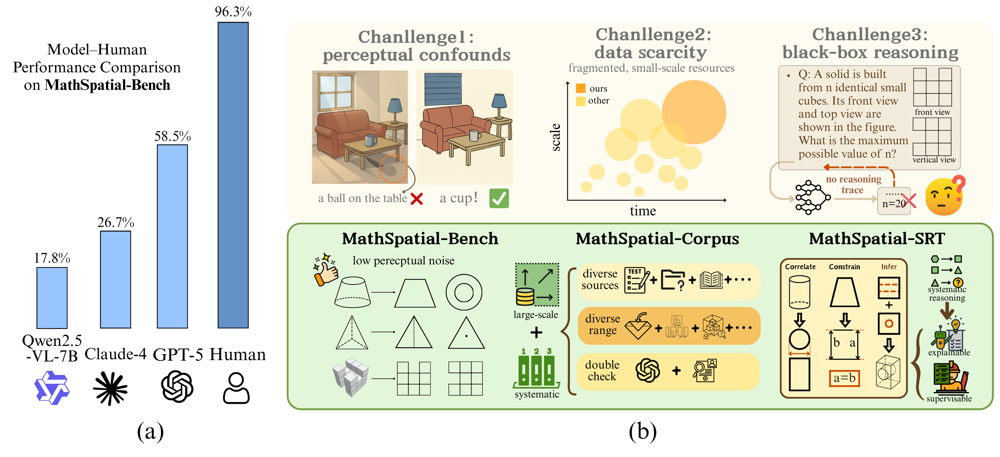
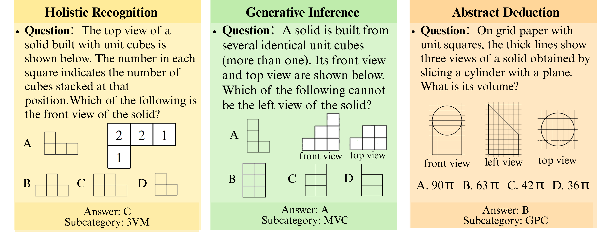
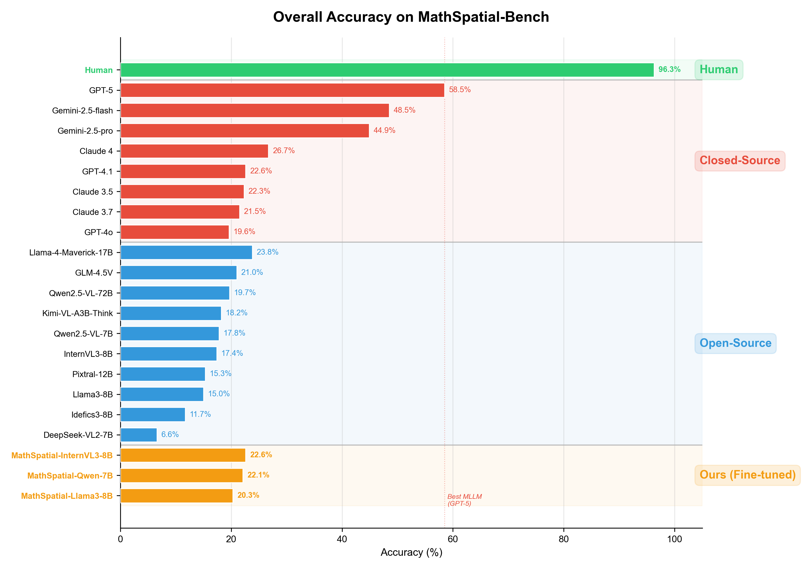
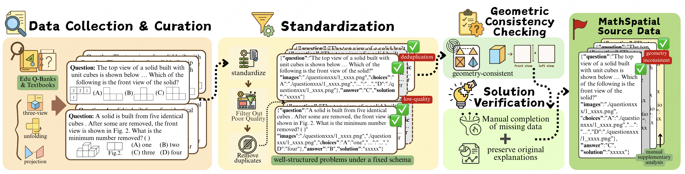
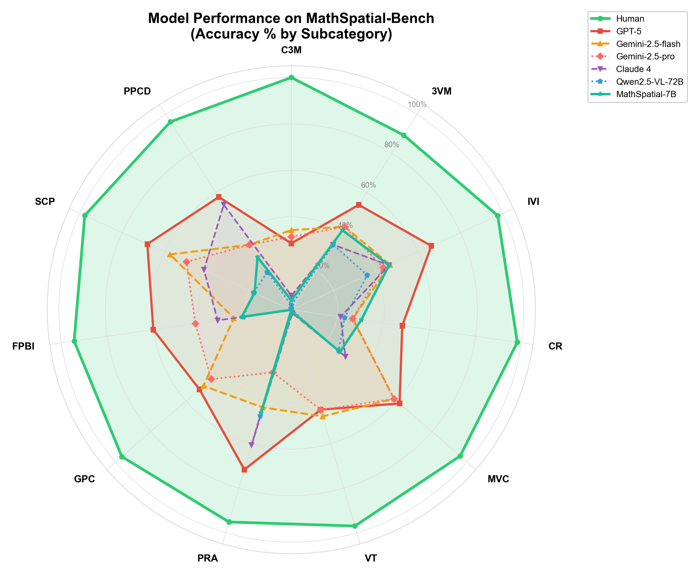

<h1 align="center">MathSpatial</h1>

<p align="center">
  <b>A Large-Scale Dataset for Evaluating Mathematical Spatial Reasoning in Multimodal Large Language Models</b>
</p>

<p align="center">
  <a href="#overview">Overview</a> •
  <a href="#key-findings">Key Findings</a> •
  <a href="#dataset-statistics">Statistics</a> •
  <a href="#getting-started">Getting Started</a> •
  <a href="#structured-reasoning-traces">SRT</a> •
  <a href="#leaderboard">Leaderboard</a> •
  <a href="#citation">Citation</a>
</p>

<p align="center">
  
  
  
  
  
</p>

---

## Overview

**MathSpatial** is the first large-scale, open dataset ecosystem dedicated to **mathematical spatial reasoning** in Multimodal Large Language Models (MLLMs). It provides 10,000 problems with 26,000+ geometric diagrams, covering tasks from multi-view recognition to geometric property calculation.

<p align="center">
  
</p>

> **Left:** Humans achieve over 95% accuracy on MathSpatial-Bench while most MLLMs remain below 60%, revealing a striking capability gap. **Right:** Three core challenges and how MathSpatial addresses them.

### Components

| Component | Size | Purpose |
|:---|:---:|:---|
| **MathSpatial-Bench** | 2,000 problems, 5,837 images | Diagnostic evaluation benchmark with calibrated difficulty |
| **MathSpatial-Corpus** | 8,000 problems, 20,308+ images | Training dataset with verified solutions |
| **MathSpatial-SRT** | 10,000 structured annotations | Structured Reasoning Traces (Correlate → Constrain → Infer) |

### Task Examples

<p align="center">
  
</p>

> Examples from the three main categories: **Holistic Recognition** (matching 3D objects to views), **Generative Inference** (completing missing views), and **Abstract Deduction** (calculating geometric properties).

---

## Key Findings

- **Massive human–model gap:** Humans achieve 96.3% accuracy; the best MLLM (GPT-5) reaches only 58.5%
- **Abstract deduction is the hardest:** Most models score below 5% on Geometric Property Calculation (GPC)
- **Scaling alone doesn't help:** Qwen2.5-VL-72B (19.7%) barely improves over its 7B variant (17.8%)
- **Training on MathSpatial works:** Fine-tuned models improve accuracy while reducing token usage by 20–30%

<p align="center">
  
</p>

---

## Dataset Statistics

### Taxonomy: 3 Categories × 11 Subtypes

<p align="center">
  
</p>

The benchmark covers **Holistic Recognition** (518 problems), **Generative Inference** (636), and **Abstract Deduction** (846), further divided into 11 subtypes reflecting representative tasks in mathematical spatial reasoning education.

### Comprehensive Statistics

<p align="center">
  
</p>

> **(a)** Main category distribution across Bench and Corpus. **(b)** Subcategory breakdown ranked by count. **(c)** Question type: 58% multiple-choice, 42% fill-in-blank for Bench. **(d)** Answer types with near-uniform A/B/C/D balance.

### Bench vs. Corpus Comparison

<p align="center">
  
</p>

| Metric | MathSpatial-Bench | MathSpatial-Corpus | Total |
|:---|:---:|:---:|:---:|
| Problems | 2,000 | 8,000 | **10,000** |
| Images | 5,837 | 20,308+ | **26,145+** |
| Avg images/problem | 2.9 | 2.6 | 2.6 |
| SRT coverage | 100% | 99.97% | — |
| English translation | 98.2% | 99.4% | — |
| Question types | MC 58% / Fill 42% | MC 46% / Fill 54% | — |

### Image & Text Statistics

<p align="center">
  
</p>

> **(a)** Over 60% of problems contain 2+ images (avg 2.9 for Bench). **(b)** Question length: Chinese avg ~80 chars, English avg ~190 chars.

See [DATASHEET.md](DATASHEET.md) for the full statistical breakdown.

---

## Data Construction Pipeline

<p align="center">
  
</p>

Starting from **35,428 raw candidates** sourced from public educational repositories:

1. **Manual Filtering** — Remove non-spatial, incomplete, or corrupted items → 21,673 retained (61.1%)
2. **Standardization & Deduplication** — Unified JSON schema, MD5 + GPT-4.1 visual similarity filtering
3. **Geometric Consistency Checking** — Rule-based verification with human-in-the-loop review
4. **Solution Verification** — Official solutions preserved; ~800 problems with graduate-student-derived solutions
5. **Annotation** — English translation, 3×11 taxonomy classification, SRT generation

Final output: **10K high-quality problems** split into Bench (2K) and Corpus (8K).

---

## Structured Reasoning Traces

Every problem is annotated with **Structured Reasoning Traces (SRT)** decomposing spatial problem-solving into three atomic operations:

| Operation | Symbol | Purpose | Example |
|:---|:---:|:---|:---|
| **Correlate** | `corr` | Establish cross-view correspondences | *"The front and left views are identical isosceles triangles"* |
| **Constrain** | `cons` | Apply geometric rules or constraints | *"The top view is a circle, constraining the base to be circular"* |
| **Infer** | `infer` | Deduce conclusions from evidence | *"A solid with triangular projections and circular top is a cone"* |

<p align="center">
  
</p>

> **(a)** Consistent operation distribution: Infer (~42%) > Correlate (~33%) > Constrain (~25%). **(b)** Average trace length is 5.1 steps, with most traces spanning 3–7 operations.

### SRT Format

```json
{
  "reasoning": [
    {"op": "Correlate", "step": "The front and left views are identical isosceles triangles."},
    {"op": "Constrain", "step": "The top view is a circle, constraining the base to be circular."},
    {"op": "Infer", "step": "A solid with triangular projections and circular top view is a cone."}
  ],
  "final_answer": "C"
}
```

---

## Leaderboard

### Overall Accuracy on MathSpatial-Bench

<p align="center">
  
</p>

| Rank | Model | Type | Overall | Best Subtype | Worst Subtype | Avg Tokens |
|:---:|:---|:---:|:---:|:---|:---|:---:|
| — | **Human** | — | **96.3%** | C3M (100%) | 3VM (89.4%) | — |
| 1 | GPT-5 | Closed | 58.5% | PRA (71.7%) | C3M (28.6%) | 676 |
| 2 | Gemini-2.5-flash | Closed | 48.5% | MVC (58.5%) | FPBI (25.0%) | 1115 |
| 3 | Gemini-2.5-pro | Closed | 44.9% | MVC (58.5%) | PRA (28.1%) | 914 |
| 4 | Claude 4 | Closed | 26.7% | PRA (60.7%) | GPC (0.2%) | 1006 |
| 5 | Llama-4-Maverick-17B | Open | 23.8% | PRA (47.6%) | GPC (4.6%) | 845 |
| 6 | **MathSpatial-InternVL3-8B** | **Ours** | **22.6%** | 3VM (50.4%) | C3M (2.0%) | **318** |
| 7 | **MathSpatial-Qwen-7B** | **Ours** | **22.1%** | IVI (46.2%) | GPC (0.0%) | **352** |
| 8 | GPT-4.1 | Closed | 22.6% | PRA (55.2%) | GPC (0.0%) | 676 |

> Full results for 16+ models available in the paper. Our fine-tuned models match or exceed much larger closed-source systems while using **50–60% fewer tokens**.

---

## Getting Started

### Repository Structure

```
MathSpatial/
├── README.md
├── DATASHEET.md                 # Full statistical datasheet
├── GLOSSARY.md                  # Chinese geometric annotation glossary
├── LICENSE                      # CC BY-NC-SA 4.0
├── dataset_statistics.json
├── assets/                      # Figures and visualizations
├── benchmark/                   # MathSpatial-Bench (2,000 problems)
│   └── questionXXXXX/
│       ├── data.json            # Problem metadata + SRT annotations
│       └── images/              # Geometric diagrams (PNG)
├── corpus/                      # MathSpatial-Corpus (8,000 problems)
│   └── questionXXXXX/
│       ├── data.json
│       └── images/
└── evaluation/                  # Evaluation scripts
    ├── build_dataset.py         # Dataset construction pipeline
    └── analyze_results.py       # Result analysis tools
```

### Loading Data

```python
import json, os
from pathlib import Path

def load_mathspatial(split="benchmark"):
    problems = []
    for qdir in sorted(Path(split).iterdir()):
        data_file = qdir / "data.json"
        if data_file.exists():
            with open(data_file, "r", encoding="utf-8") as f:
                problem = json.load(f)
            problem["images_dir"] = str(qdir / "images")
            problems.append(problem)
    return problems

bench = load_mathspatial("benchmark")   # 2,000 problems
corpus = load_mathspatial("corpus")     # 8,000 problems

print(f"Benchmark: {len(bench)} problems")
print(f"Corpus: {len(corpus)} problems")
```

### Data Format

Each `data.json` contains:

| Field | Description |
|:---|:---|
| `question` | Original Chinese question text |
| `question_en` | English translation |
| `images` | List of image paths (relative) |
| `choices` | Answer options `{"A": "...", "B": "...", ...}` |
| `answer` | Ground-truth answer |
| `analysis` | Solution explanation |
| `question_type` | `选择题` (multiple choice) or `填空题` (fill-in-blank) |
| `main_category` | One of: Holistic Recognition, Generative Inference, Abstract Deduction |
| `sub_category` | One of 11 subtypes (CR, 3VM, IVI, C3M, PRA, MVC, VT, PPCD, FPBI, SCP, GPC) |
| `atomic_cot_gpt_4o_*` | Structured Reasoning Trace (SRT) annotation |

### Running Evaluation

```bash
cd evaluation
python analyze_results.py --benchmark_dir ../benchmark
```

---

## Data Provenance

Problems are sourced from publicly available **Chinese K-12 educational repositories**, including exam archives, textbook exercises, and online problem banks (e.g., Baidu Wenku, Zujuan). All textual content is provided in both Chinese and English.

**About Chinese annotations in images:** Geometric diagrams may contain Chinese labels such as "正视图" (Front View), "侧视图" (Side View), "俯视图" (Top View). These are standard geometric terms—see [GLOSSARY.md](GLOSSARY.md) for a complete Chinese-English translation reference.

> **Why this doesn't affect evaluation:** Mathematical spatial reasoning is inherently language-independent. The core challenge lies in visual-spatial perception and geometric reasoning, not linguistic understanding. All geometric diagrams follow universal Euclidean conventions.

---

## License

This dataset is released under the [Creative Commons Attribution-NonCommercial-ShareAlike 4.0 International License](LICENSE) (CC BY-NC-SA 4.0).

| Permission | Status |
|:---|:---:|
| Academic research use | ✅ Allowed |
| Attribution required | ✅ Required |
| Commercial use | ❌ Not allowed |
| Derivative works (same license) | ✅ Allowed |

